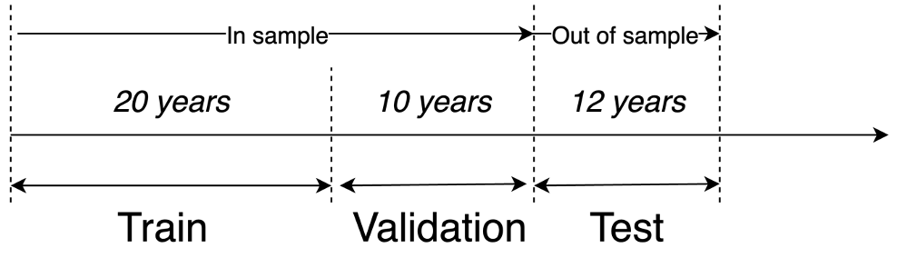
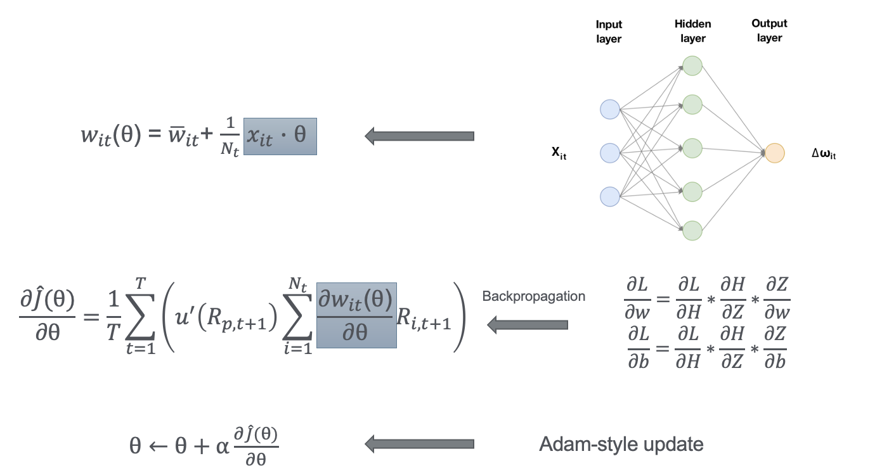
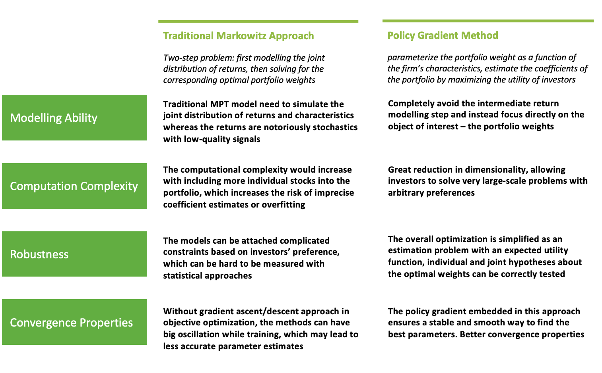
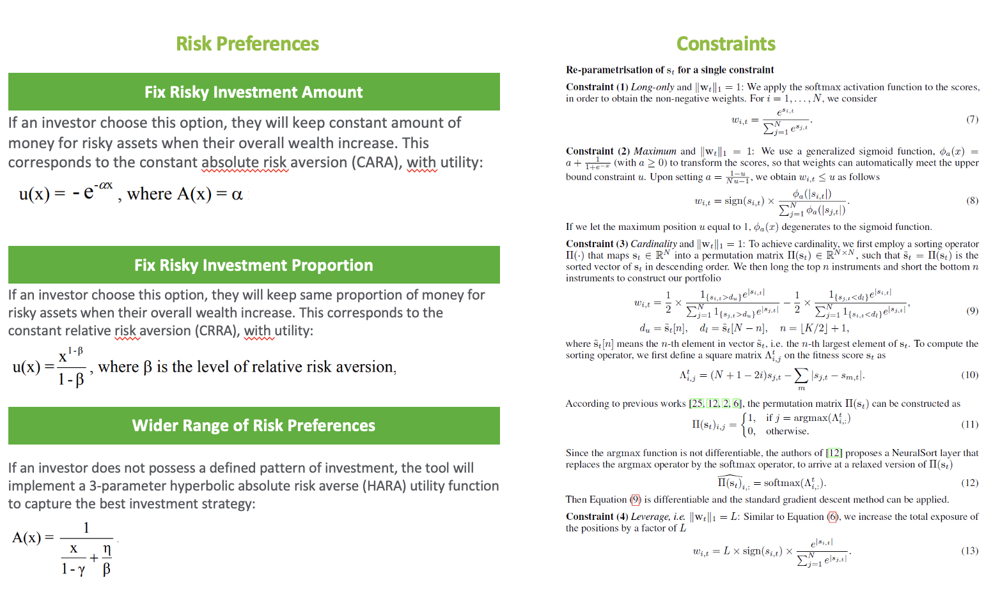
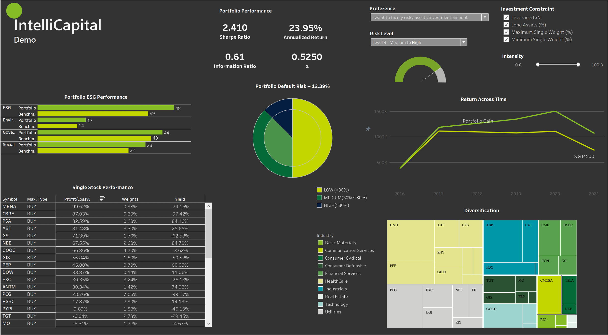

# Intellicap 

# Table of Contents
1. [General Introduction](#introduction)
    1. [Purpose](#11)
    2. [Business Challenge](#12)
    3. [Proposed Solution](#13)
    4. [Potential Impact](#14)
    5. [Go-to-market Strategy](#15)
2. [Technical Foundation](#techfound)
   1. [Data Preparation](#21)
   2. [Methodology Overview](#22)
   3. [Advantages over Traditional Model](#23)
   4. [Quantitative Representations for Investment Preference](#24)
3. [Dashboard Demo](#demo)
    1. [Tableau Demo](#31)
    2. [Video Presentation](#32)
4. [Architecture & Code](#code)
   1. [Overall Folder Structure](#41)
   2. [Overall Code Structure](#42)
   3. [Limitations](#43)

 

# General Introduction 
## Purpose 
**Intellicap** focuses on tackling the portfolio optimization challenges common in the investment management industry. Effective optimization approaches can have decisive impact on the ultimate quality of the portfolio returns. IntelliCapital directly targets on only one problem, which is optimizing investors’ utility, and the tool also provides a one-step solution to clients’ periodically portfolio rebalancing. It provides interpretable optimization process and allows investors to customize their own investment preferences. In model training procedure, the optimizer adopts neural networks to capture short-term speculations and market sentiments, so this might give investors more opportunities to win out at different time horizons.

## Business Challenge 
Portfolio optimization has key influences on the ultimate quality of the investment strategy and portfolio returns. Our investment management clients may have suffered the high computation complexity and low-quality signals from traditional optimization methods. Deloitte’s applied quantitative modelling techniques and decades of interactions with the clients will make this evolution possible.

## Proposed Solution 
Compared to traditional methods, IntelliCapital provides interpretable optimization process and allows investors to customize their own investment preferences. The neural-network-based optimizer embedded in IntelliCapital would maintain the robustness of the portfolio performance.
The deployment of IntelliCapital will be based on pre-agreed investment pools and investment preference range. Leveraging the deep learning optimizer at backstage, the tool will display the final performance and portfolio weights prediction in the dashboard. Clients can view portfolio results and model performances simply by changing the preferences on the dashboard.

## Potential Impact 
The core algorithms embedded in IntelliCapital (policy gradient) have been proved to have excellent performance on a sample stock pool. IntelliCapital will help the clients gain a high-level understanding of their portfolio investment strategy and potentially higher returns. From ‘Default Risk’ and ‘ESG Performance’ section, investors can understand their portfolio beyond trading, which allows us to provide sustainable insights for clients. 

## Go-to-market Strategy 
The strategy will start from provocation, the models have been structured and coded, whereas they need to be tested on more samples to maintain their robustness across different portfolios. Once the algorithm design has been widely tested effective, the tool can be introduced to clients and integrated by clients’ own portfolios and preferences, and the deployment would be effective due to the product’s automated nature. The product will be packaged as a ‘tick-list’ for clients to specify the range and complexity of the risks they would like to assess on. The interactive dashboard would be the final deliverable, and the optimization python package can be additionally charged for clients’ development purpose. 

# Technical Foundation 

## Data Preparation 

- Dataset is from CRSP-Compustat

- Date is from 1974 to 2016 (42 years)

- Variables X are entered in the policy in the standard form

- 94 stocks characteristic variables in the dataset

- Basic three X variables:
    The log of the firm’s market equity (me)
    Firm’s log book-to-market ratio (btm)
    For each firm the lagged 1-year return (mom)

- ret – one month stock return

- Rf – one month Treasury bill rate

- Data split: 

## Methodology Overview 

- This is a one period portfolio weight problem: optimize the portfolio choice by using policy gradients method.

- Reinforcement Learning: we use experience to learn about the (𝜕𝐽 (θ))/𝜕θ

## Advantages over Traditional Model 

- Traditional Markowitz approach treats optimization as a two-step problem:first modelling the joint distribution of returns, then solving for the corresponding optimal portfolio weights. While the proposed methods in Intellicap parameterizes the portfolio weight as a function of the firm’s characteristics, estimates the coefficients of the portfolio by maximizing the utility of investors, an achieves the advantages as listed below: 
 

## Quantitative Representations for Investment Preference 

- Users can customize the risk preferences in the dashboard. Each type of the risk reprefernce has their mathematical representation as defined in the paper [A Universal End-to-End Approach to Portfolio Optimization via Deep Learning
](https://arxiv.org/abs/2111.09170). Below is a one-to-one mapped quantitative representations for the investment preferences:

# Dashboard Demo 
## Tableau Demo 

 

## Video Presentation 

[Watch the video](https://www.youtube.com/watch?v=hngbtYXGcd8)

